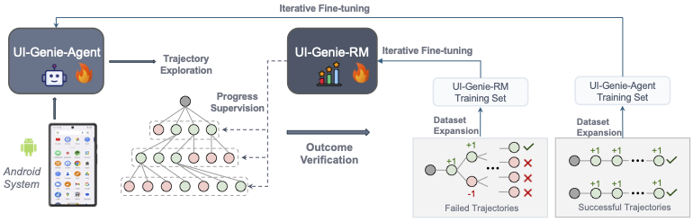
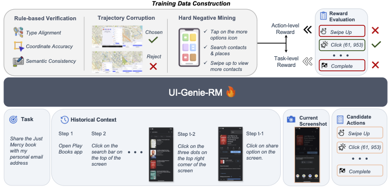

<div align="center">

# 🧞 UI-Genie: A Self-Improving Approach for Iteratively Boosting MLLM-based Mobile GUI Agents

</div>


This work presents **UI-Genie**, a self-improving framework that enhances MLLM-based GUI Agents through iterative agent-reward model co-evolution, achieving state-of-the-art performance without manual annotation.

 [[📖 Paper]()] [[🤗 Models](https://huggingface.co/HanXiao1999/UI-Genie-Agent-7B)] [[📊 Dataset](https://huggingface.co/datasets/HanXiao1999/UI-Genie-Agent-5k)]

## 👀 Overview

<div align="center">
  
</div>

**UI-Genie** introduces a novel self-improving framework for GUI agents that:
- 🎯 **Eliminates manual annotation** through iterative synthetic trajectory generation
- 🔄 **Co-evolves agent and reward models** through self-improvement cycles
- 📊 **Generates high-quality datasets** without human effort
- 🏆 **Achieves SOTA performance** across multiple benchmarks


### 🌟 Key Features
<div align="center">
  
</div>

- **UI-Genie-RM**: First specialized reward model for GUI trajectory assessment with image-text interleaved architecture
- **Self-Improvement Pipeline**: Progressive expansion of solvable GUI tasks through reward-guided exploration
- **Synthetic Data Generation**: High-quality trajectory synthesis with accurate process supervision


## 🤖 Model Zoo

### Released Models

| Model | Size | AndroidControl-Low | AndroidControl-High | AndroidLab | Android Arena | Download |
|-------|------|-------------------|---------------------|------------|---------------|----------|
| | | SR | SR | SR | SR | |
| UI-Genie-Agent | 3B | **93.8** | **72.9** | 28.8 | - | [🤗 HuggingFace](https://huggingface.co/UI-Genie/UI-Genie-Agent-3B) |
| UI-Genie-Agent | 7B | **94.3** | **74.2** | **38.7** | **20.4** | [🤗 HuggingFace](https://huggingface.co/UI-Genie/UI-Genie-Agent-7B) |
| UI-Genie-Agent | 72B | **94.8** | **77.0** | **41.2** | - | Coming soon


### Reward Model

| Model | Size | Step-Level F1 | Outcome-Level F1 |
|-------|------|---------------|------------------|
| UI-Genie-RM | 7B | **79.6** | **82.1** |


## 📊 Datasets

We release two novel datasets that enable training GUI agents without manual annotation:

| Dataset | Size | Description | Link |
|---------|------|-------------|------|
| **UI-Genie-RM-517k** | 517K | First reward dataset for GUI agents | Coming soon |
| **UI-Genie-Agent-16k** | 16K | High-quality synthetic trajectories | [🤗 HuggingFace](https://huggingface.co/datasets/HanXiao1999/UI-Genie-Agent-5k) |


> 📢 **Note**: We currently release a 5K sample of our trajectory dataset. The full datasets (UI-Genie-Agent-16k and UI-Genie-RM-517k) will be released soon!


## 🛠️ Installation

1. Clone this repository:
```bash
git clone https://github.com/Euphoria16/UI-Genie.git
cd UI-Genie
```

2. Create conda environment:
```bash
conda create -n ui-genie python=3.9 -y
conda activate ui-genie
```

3. Install dependencies:
```bash
pip install -r requirements.txt
```


## 📊 Evaluation

### Prerequisites

Before running evaluations, you need to download the source images from AndroidControl:
```bash
# Download AndroidControl images and place them in the correct directory
# Place images under: src/ms-swift/data/androidcontrol/imgs/
```

### AndroidControl Benchmark

We provide evaluation scripts using the [ms-swift](https://github.com/modelscope/swift) library with pre-configured JSONL files located in `src/ms-swift/data/`.

#### High-Level Task Evaluation
Evaluate agent performance on high-level tasks that multi-step execution:
```bash
cd src/ms-swift
bash exps/eval_androidcontrol_swift_high_level.sh
```

#### Low-Level Task Evaluation
Evaluate agent performance on low-level tasks with step instructions:
```bash
cd src/ms-swift
bash exps/eval_androidcontrol_swift_low_level.sh
```

### Other Benchmarks
Additional evaluation scripts for AndroidLab and Android Arena benchmarks will be released soon.

## 🔥 Training

We train UI-Genie agents based on the **Qwen2.5-VL** model family with the [ms-swift](https://github.com/modelscope/swift) framework for supervised fine-tuning.

### Training Data

Our training pipeline combines multiple datasets:
- **AndroidControl** training set
- **AMEX** training set  
- **AndroidLab** training set
- **[UI-Genie-Agent-16k](https://huggingface.co/datasets/HanXiao1999/UI-Genie-Agent-5k)** 

### Training Scripts

#### UI-Genie-Agent-3B (Full Fine-tuning)
Train the 3B model with full parameter fine-tuning:
```bash
cd src/ms-swift
bash exps/train_agent_3B.sh
```

#### UI-Genie-Agent-7B (Full Fine-tuning)
Train the 7B model with full parameter fine-tuning:
```bash
cd src/ms-swift
bash exps/train_agent_7B.sh
```

#### UI-Genie-Agent-72B (Parameter-Efficient Fine-tuning)
Train the 72B model using RSLoRA for peft:
```bash
cd src/ms-swift
bash exps/train_agent_72B.sh
```


## 🤝 Acknowledgements

We thank the teams behind [Qwen2.5-VL](https://github.com/QwenLM/Qwen2.5-VL), [AndroidControl](https://github.com/google-research/google-research/tree/master/android_control), and [AndroidLab](https://github.com/THUDM/Android-Lab) for their foundational work and [ms-swift](https://github.com/modelscope/ms-swift) for the efficient training and inference framework.

## 📧 Contact

For questions and feedback, please open an issue or contact:
- Han Xiao: [1155229123@link.cuhk.edu.hk](mailto:1155229123@link.cuhk.edu.hk)

## 📄 License

This project is released under the [MIT License](LICENSE).
